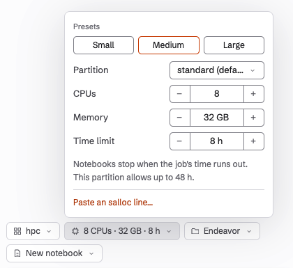

A cluster is a group of shared computers. You sign in to a login node, and
your work runs on compute nodes as jobs that a scheduler starts when there is
room. Endeavor works with clusters that use the Slurm scheduler. It submits a
job for you, runs Julia and the notebook inside it, and connects you to it.

Claude and Endeavor stay on your Mac, as with a [server](./servers.md).

## What you need

- You can sign in to the cluster's login node from Terminal on your Mac, for
  example with `ssh hoffman2`.
- The cluster uses Slurm, and you can submit jobs there.

## Add a cluster

1. Open the **Where** chip on the **Start a session** screen, and click
   **Add cluster…**. You can also add one in Settings, under **Where
   notebooks run**.
2. Fill in **SSH host** and, if you like, **Name**, as for a server.
3. Fill in the cluster's own fields, all optional:
   - **Account**: the Slurm account to charge, if you have more than one.
   - **How to get Julia**: a path to `julia`, or a shell line such as
     `module load julia`. Empty finds Julia, or downloads one.
   - **Where to keep Julia packages**: by default, the cluster's scratch
     space (`$SCRATCH/endeavor/depot`), since home folders on clusters are
     usually small. Without scratch space, `~/.cache/endeavor/depot`.
   - **Default resources for new sessions**: the job size to start from.
4. Click **Test connection**. Endeavor checks that Slurm is there and lists
   the cluster's partitions, the groups of nodes you can submit to, with each
   one's time limit and node size. It doesn't start a job.
5. Click **Add**.

## Choose the job's resources

On the **Start a session** screen, a cluster session has a resources chip,
for example "8 CPUs · 32 GB · 8 h". Click it to set this session's job:

- a preset: **Small** (2 CPUs, 8 GB, 2 hours), **Medium** (8 CPUs, 32 GB,
  8 hours) or **Large** (32 CPUs, 128 GB, 24 hours);
- the partition;
- CPUs, memory and time limit, each kept within what the partition allows.

If you already have an `salloc` line that you use on this cluster, click
**Paste an salloc line…**, paste it, and click **Use these**. Endeavor reads
the partition, CPUs, memory, time limit, account and GPUs from it, and
passes other options on to the job.

The session remembers its resources. When you reopen it later, the new job
uses the same ones.

## Wait for a node

When the session starts, Endeavor submits the job. The notebook pane shows
"Submitted job" with its number, then "Waiting for a node", with how long it
has waited and why, in plain words, such as "other jobs are ahead in the
queue". Click **Cancel** to take the job out of the queue.

If you quit Endeavor while the job waits, it stays in the queue.

## When the job's time runs out

A job stops at its time limit, and the notebook stops with it. Endeavor warns
you:

- The notebook's header shows when the job ends, such as "Job ends 18:40".
  It turns orange in the last 15 minutes.
- At 15 minutes, the chat says: "The cluster job running Julia on hoffman2
  ends at 18:40 (in 15 min), and its notebooks stop then. The notebook file
  is already saved; Start Julia afterwards runs it in a new job."

When the job ends, Endeavor says why, for example "Julia on hoffman2
stopped. Its Slurm job reached its time limit." Other reasons are that the
cluster preempted the job, the job was cancelled, it ran out of memory, or
its node failed.

The notebook file is saved on the cluster. To go on, click **Start on
hoffman2** in the notebook pane.
Endeavor submits a new job and runs the notebook from the top. If a job keeps
running out of time or memory, choose bigger resources before you start it.

## While the job runs

- Claude's commands run on the compute node, inside the job.
- Leaving the app doesn't end the job. The notebook keeps running until the
  job's time limit, until you stop it, or until it has been idle for the
  **Stop idle notebooks after** time.
- To stop the job early, click **Stop** next to the cluster in Settings,
  under **Where notebooks run**. A job that is still waiting in the queue has
  **Cancel job** instead.
