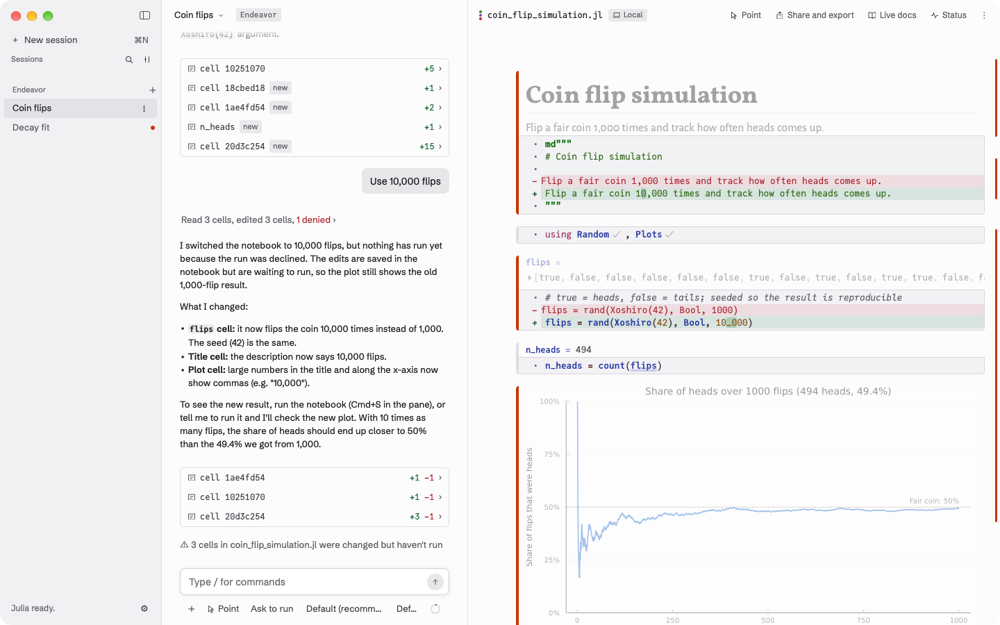

Endeavor is a Mac app for doing your own data analysis with Claude, an AI
assistant made by Anthropic. You describe what you want in a chat. Claude
writes the code and runs it in a notebook next to the chat, and you watch each
step, change what you like, and decide what runs.

## The words this guide uses

- **Julia** is the programming language the code is written in. You don't
  need to know it to start. Claude writes the code, and you can ask it to
  explain any part.
- **A notebook** is a file that holds code together with its results:
  numbers, tables and plots. Endeavor uses [Pluto](https://plutojl.org)
  notebooks, which are plain Julia files ending in `.jl`.
- **A cell** is one piece of a notebook: a few lines of code with their
  result shown above them. In a Pluto notebook, when you change a cell, the
  cells that use its result run again by themselves, so what you see always
  matches the code.
- **A session** is one conversation with Claude, together with its notebook.
- **A server** is another computer you reach over the network, such as a
  lab machine. **A cluster** is a group of shared computers where work runs
  as scheduled jobs. Endeavor can run your notebook on either one. See
  [Servers](./servers.md) and [Clusters](./clusters.md).

## The notebook is the record

The chat is where you and Claude talk. The notebook is what you keep. It
holds every step of the analysis as code, with the result of each step right
under it, so you or a colleague can read it, check it, and run it again
later. Ask Claude to put explanations in the notebook as text, so the
reasoning stays with the code.

## What you need

- A Mac with macOS 13 (Ventura) or later. Apple silicon and Intel Macs both
  work.
- A Claude account that includes Claude Code: a Claude Pro, Max, Team or
  Enterprise plan, or an Anthropic Console account. A free Claude account
  can't be used.
- An internet connection the first time you open Endeavor, and whenever you
  talk to Claude. Notebooks on your Mac keep working offline.

Endeavor is made for macOS. A Windows 10 or 11 (x64) build is there to try:
see [On Windows](#on-windows). There is no Linux version.
Besides Claude, a session on your Mac can use Codex, OpenAI's assistant,
with a ChatGPT account. Pick it on the new-session screen. Other assistants
are listed in Settings as **Not available yet**.

There is no signed download yet. For now, Endeavor is
[built from its source code](https://github.com/jowch/Endeavor#build-it). The
app also can't update itself yet.

## On Windows

The Windows build has made a notebook and run a Claude session from start
to finish on Windows 10. It has rough edges:

- It isn't signed, so Windows may say "Windows protected your PC". Choose
  **More info**, then **Run anyway**.
- There is no download page yet. You need a GitHub account to get it.
- It can't use servers or clusters yet. Notebooks run on your computer.
- Signing in to Claude for the first time hasn't been tried on Windows yet.
- Claude Code on Windows has needed [Git for Windows](https://git-scm.com/downloads/win).
  Install it first if you don't have it.

To install it:

1. Sign in to GitHub and open the newest
   [Windows build](https://github.com/jowch/Endeavor/actions/workflows/windows.yml?query=branch%3Amain+is%3Asuccess)
   on `main`. Under **Artifacts**, download
   `Endeavor-windows-x86_64-setup-…` and unzip it. Builds are kept for 30
   days.
2. Run `Endeavor-setup-….exe`. It installs for you only and doesn't ask for
   an administrator.
3. Click **Install**, then **Finish**. Endeavor opens and sets itself up.

Uninstall it from **Settings → Apps**. Your sessions and settings stay in
`%LOCALAPPDATA%\Endeavor`, and Julia stays in juliaup.

## What Endeavor installs on first launch

Endeavor sets up the programs it needs the first time you open it. This
takes a few minutes and needs the internet once.

- **Julia 1.12.6**, from julialang.org (about 230 MB, or 270 MB on an
  Intel Mac).
- **Node.js 24.21.0**, from nodejs.org (about 50 MB). Endeavor uses it to run
  Claude Code.
- **Claude Code** and the adapter Endeavor uses to talk to it, from the npm
  package registry (about 110 small packages).
- **Pluto and the packages it needs**, which Julia downloads from Julia's
  package registry.

On Windows, Julia comes from juliaup, Julia's own installer, which
Endeavor installs if you don't have it; juliaup checks the Julia it
downloads. Endeavor checks the Node.js download, and outside Windows the
Julia download, against fixed checksums before it uses them, and Claude Code's packages against a fixed list. A
download that doesn't match is deleted, and setup stops and tells you.

Everything goes into one folder:
`~/Library/Application Support/endeavor/`. The `~` stands for your home
folder. You don't need to install Julia or Claude Code yourself. If you
already have your own Julia, you can tell Endeavor to use it instead. See
[Settings](./settings.md).

Next: [Get started](./getting-started.md).
