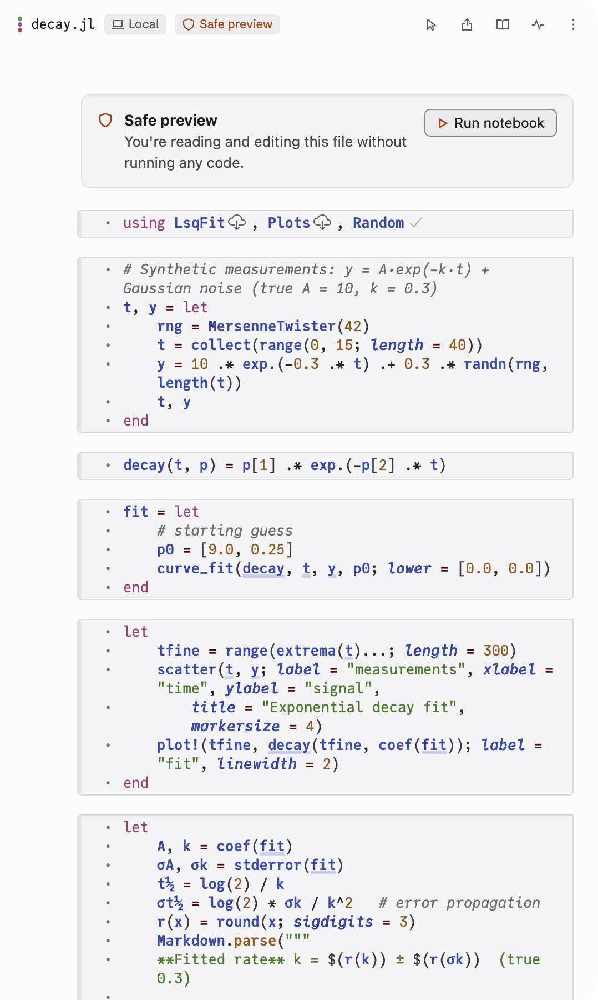

A notebook you open from disk doesn't run when it opens. It opens in safe
preview: you can read it and edit it, but none of its code runs until you say
so.

## Why notebooks open this way

Running a notebook runs all of its code. That code can read, change or delete
files on the computer it runs on. A notebook from a colleague, a download or
an old project may do things you don't expect. Safe preview lets you read it
first.

## When a notebook opens in safe preview

- You open a notebook that is already on disk, for example by picking it in
  the notebook chip when you start a session. This happens in every mode,
  **Auto** included.
- You open an earlier session after Endeavor or Julia restarted, and Julia
  no longer has the notebook open.
- You start a notebook again after it stopped, and its file changed on disk
  in the meantime, or it was in safe preview when it stopped.
- You find a moved notebook with **Locate file…**.
- Julia stopped unexpectedly twice while running the notebook. See
  [Troubleshooting](./troubleshooting.md#julia-stopped-unexpectedly).

Notebooks that Endeavor or Claude create run without safe preview.

## What you see

The header shows a **Safe preview** label. At the top of the notebook a box
says "You're reading and editing this file without running any code.", with
a **Run notebook** button.

You can edit cells in safe preview. Nothing runs while you do.

## Run the notebook

When you've read the notebook and are happy to run it, click **Run
notebook**. The whole notebook runs from the top, and from then on it works
as usual.

In **Manual** and **Ask to run**, Claude can also ask to run it. Its card
says "Let this notebook run?", with **Not now** and **Run notebook**. While
the card waits, the box in the notebook says "Claude is asking to run it.
Answer in the chat, or here." Either button answers it.

In **Auto**, Claude can run the notebook without asking. Pick another mode
before you open a notebook you haven't read.
