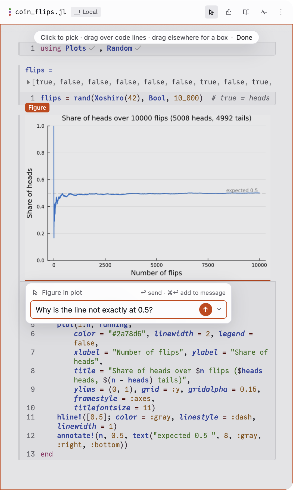

A session is one conversation with Claude and the one notebook it works in.
The window has three columns: your sessions on the left, the chat in the
middle, and the notebook on the right. Drag the lines between them to resize
them. Press ⌘B to hide or show the sidebar.

## One notebook per session

Each session has exactly one notebook. Claude can't open or create a second
notebook in the same session. To work on another notebook, start a new
session (⌘N, or **+ New session** at the top of the sidebar). To start a new
conversation about the same notebook, open the notebook's **⋮** menu and
choose **Open in a new session…**.

## What you see while Claude works

- **The chat** shows Claude's replies. Each step it takes, such as reading a
  cell or editing one, is a single grey line. Click **›** on a line to see
  the details, such as the change to the code.
- **A progress list** above the message box shows Claude's plan for longer
  tasks, with the current step highlighted.
- **The notebook** changes as Claude works. A cell Claude has changed but not
  yet run has an orange bar at its left edge, and its old result is faded.
  The changed lines are marked in the cell's margin. The orange goes away
  once the cell runs.

When Claude finishes a reply, a card lists every cell it changed in that
reply, with **new** or **deleted** next to cells it added or removed, and the
number of lines added and removed. Click a row to scroll the notebook to that
cell.

## Send messages while Claude works

You don't have to wait for Claude to finish:

- Press Return to queue a message. It goes when the current reply ends.
- Press ⌘Return to send it now, so Claude reads it in the middle of its
  current reply.
- Press Esc to stop Claude.

Queued messages wait above the message box. You can edit, remove, or send
each one early.

## Edit the notebook yourself

The notebook is yours to edit. Click a cell, change the code, and press
Shift-Return to run it, as in any Pluto notebook. Claude is told which cells
you changed with your next message, so it reads them again before it relies
on them.

## Ask about one part of the notebook

You can point Claude at one cell, a few lines, or part of a plot, instead of
describing it in words.

- **Point** (⌘⇧E, View ▸ Point, or **Point** under the message box). The notebook dims.
  Click a cell, a plot or a paragraph to pick it. Drag over code to pick
  lines, or drag anywhere else to draw a box. Hold Shift to pick more than
  one thing. Type your question in the bar that opens and press Return.
  Click **Done** to turn Point off.
- **Reply**. Select some text in a cell, in a result, or in one of Claude's
  replies. A **Reply ⌘E** button appears under it. Click it, or press ⌘E,
  type your question, and press Return.
- **⌘E in a cell**. With the cursor in a cell and nothing selected, press
  ⌘E to ask about that whole cell. In an empty cell, ⌘E asks Claude what to
  write there.
- **✦ Claude between cells**. Hover between two cells and click **✦ Claude**
  to ask Claude to write a new cell in that spot.

In each of these, Return sends your question now as its own message.
⌘Return adds it to the message box instead, so you can collect several
before you send them together. Esc closes the question and keeps what you
typed for next time.

## When a cell fails

When a cell's code fails, the error shows under the cell with two buttons:

- **✦ Fix with Claude** asks Claude to fix the error.
- **Explain** asks Claude to explain the error without changing anything.

A cell that fails only because a cell above it failed says so ("Fails
because `fit` failed"), with a link to that cell.

## The notebook's header

The header above the notebook shows:

- the file name;
- where the notebook runs: **Local** for your Mac, or the server's name;
- labels such as **Safe preview**, **Not saved** or **Package failed** when
  something needs your attention;
- **Status**, which shows what Julia is doing, such as installing packages,
  and the log behind it;
- **Live docs**, which shows help for the Julia function under the cursor;
- the **⋮** menu, which includes **Copy path**, **Reveal in Finder**,
  **Rename…**, **Move to…**, the notebook look, **Keyboard shortcuts**,
  **Open in a new session…**, and **Restart notebook** and **Stop
  notebook**.

The **Share and export** button exports the notebook as a **Notebook file…**, **Static
HTML…** or **PDF…**, and has Pluto's **Present**, **Record…** and
**Frontmatter…**.

To search the notebook's text, press ⌘F.

## Your sessions in the sidebar

The sidebar lists your sessions, grouped by folder. Each row starts with a
small bullet that shows the session's state:

- a grey ring: nothing is happening;
- a grey dot that pulses: Claude is working (with Reduce motion on, the dot
  stays still);
- an orange dot: Claude is waiting for your answer;
- an orange ring: there is a new reply you haven't seen;
- a red warning sign: the session stopped with an error.

Hold the pointer over a bullet to read its state in words. When a folder is
collapsed, the bullet that matters most in it shows next to the folder's
name.

When Claude asks you something while Endeavor isn't the app in front, macOS
shows a notification, "Claude is waiting for you". Click it to go to that
session.

Click **⋮** on a row for **Rename**, **Reveal folder in Finder**,
**Archive**, **Close** and **Delete…**. Delete removes the conversation,
including its Claude Code history. The notebook and the other files the
session made stay on disk.

## How much Claude can keep in mind

The ring at the right end of the bar under the message box shows how much of
the conversation Claude can still keep in mind. Hover over it for details.
When it nears full, Claude summarizes the conversation by itself. To choose
when that happens, type `/compact` and send it. The whole conversation stays
in the chat either way.
